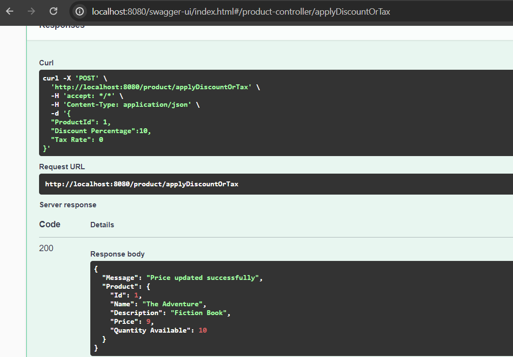
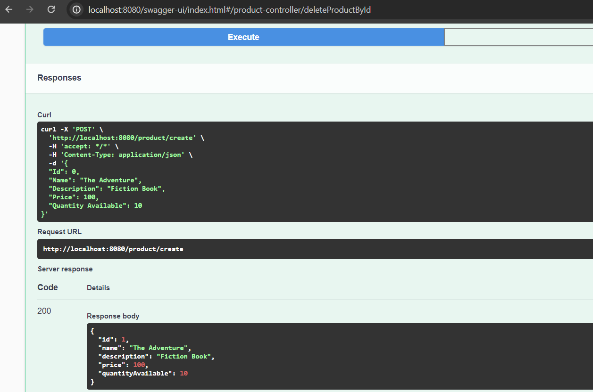

# **PROJECT NAME:** *Product Service*

## _**Authors**_

Name| Role | Date
----- |------|------
Rajubabu N | Developer | 12-02-2024

## _**CONTENTS OF THIS FILE**_

* [Overview](#overview)
* [Required Software to run Application](#installsoftware)
* [Database](#database)
* [EndPoints](#endpoints)
* [Swagger Details](#Swagger)

###  _**Overview**_

Product service is an application built on Spring Boot Microservice.It is used to create, update, retrieve and delete product information and modiying price of a product.Enabled Swagger API Documentation.

###  _**Required Software to run Application**_

Verify Java is installed in system by executing command in CMD : java -version .
If JDK is not present then download Adopt Open JDK using link : https://adoptium.net/temurin/releases/

Download any Eclipse to run application .Spring Tool Suite Download link :https://spring.io/tools/

Set 'Path' in Environment variable to bin folder under Java. i.e.: E:\Apps\OpenJDK17U-jdk_x64_windows_hotspot_17.0.9_9\jdk-17.0.9+9\bin

Clone the project from GIT URL:  

Import the Project into Eclipse and start the application

###  _**Databse**_

Properties file is configured H2 databse connection.

###  _**EndPoints**_

Application endpoints can be accessed using Swagger URL:http://ec2-13-239-26-205.ap-southeast-2.compute.amazonaws.com:8080/swagger-ui/index.html#/

Authorize with Bearer token in Swagger.

Method Name |URL | Method | Payload | Remarks
------|------|------ |------------|--------
Create Product|http://localhost:8080/product/create | POST | {"Name": "The Adventure","Description": "Fiction Book", "Price": 100,"Quantity Available": 10} | Price should be grater than 0
Get Product By ID|http://localhost:8080/product/getById/1 | GET | |
Update Product|http://localhost:8080/product/update | PUT | {"Name": "The Adventure","Description": "Fiction Book", "Price": 100,"Quantity Available": 10} | 
Delete Product by ID|http://localhost:8080/product/deleteById/1 | DELETE | | 
Modify Product Price|http://localhost:8080/product/applyDiscountOrTax | POST | | Either Discount or Tax should be greater than 0

###  _**Swagger Details**_

Service Endpoints can be accessed using below Swagger URL after service is started in local machine.

http://localhost:8080/swagger-ui/index.html#/

Snapshots:
Modify Price: 

Create Product:

